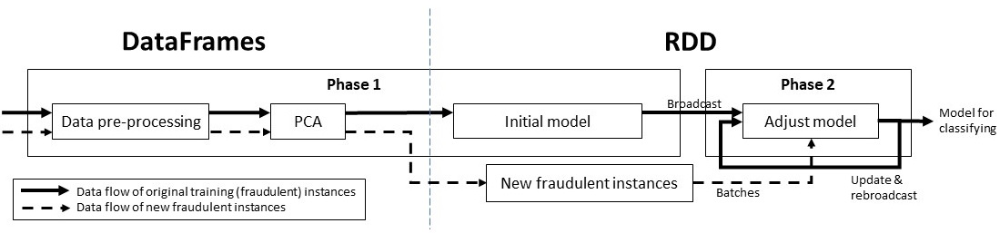
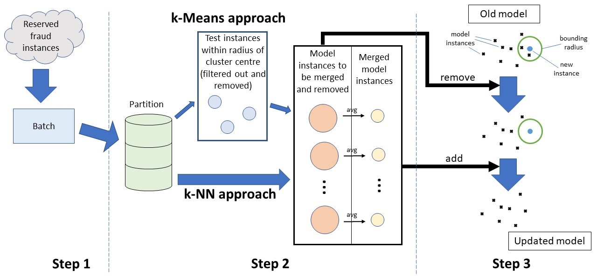
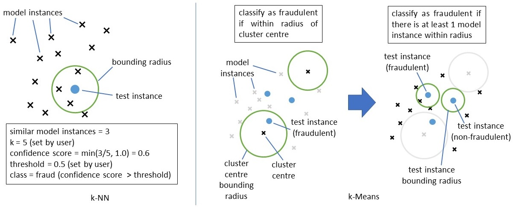
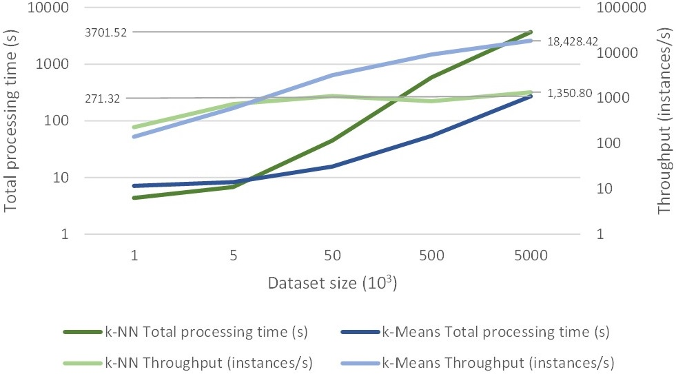
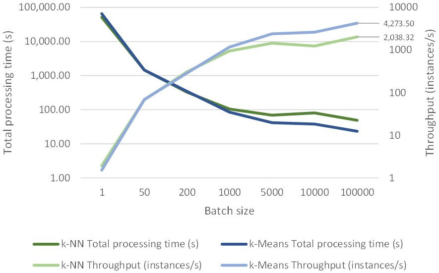

# Similarity-based One-Class Classification for Fraud Detection in the Big Data Context

### Developed by Team 19 (NottATeam) of the Big Data Module, consisting of:
### Tze Ee Yong, Jiachenn Choong, Hui Shen Sam, Dong Jun Lee

## Motivation
Fraud detection has been one of the main topics in banking, finances or insurance companies. In 2020, the banking industry had protected customers with over £1.6 billion of fraud stopped. With the increase in online transactions through the usage of debit/credit cards, the number of fraudulent transactions also increases. Therefore, there is a need to design fraud detection algorithms for preventing frauds. 

There is a lack of existing literature which covers the intersection between these 3 aspects, `Big Data`, `One-class Classification` and `Similarity-based approaches`. Therefore, our work aims to find out the feasibility of using similarity-based approaches in the context of Big Data based on the gaps in the literature.

In our work, we implemented two classifiers for the fraud detection task: the first one which uses the K-means clustering algorithm and the second one uses the k-Nearest Neighbour (kNN) algorithm. Both algorithms classify an instance by using similarity measures such as Euclidean distance, where smaller Euclidean distance value indicates higher similarity between two instances in the vector space.

## Obtaining our Dataset
We use the dataset provided by the IEEE-CIS Fraud Detection challenge which can be found by clicking [this hyperlink](https://www.kaggle.com/c/ieee-fraud-detection/data?select=train_identity.csv).

The challenge consists of a train and a test dataset, with each constituting two component datasets: transaction and identity. For the train dataset, there is a total of 590,540 transactions, with 20,663 (3.5%) fraudulent transactions and 569,877 (96.5%) non-fraudulent transactions. As this challenge was originally a competition, the ground truths of the test dataset are not provided. The test dataset has a total of 506691 unknown transactions.


## Running our implementation
Our implementation was developed on Databricks, with access provided by the University. All implementations are provided in `.ipynb` format that tailors to Databricks functionality. However, you can also run this implementation by cloning the repository as follows:

### Cloning over HTTPS
```
$ git clone https://projects.cs.nott.ac.uk/comp4103/2020-2021/team19.git
```

### Cloning over SSH
```
$ git clone git@projects.cs.nott.ac.uk:comp4103/2020-2021/team19.git
```

## Required Dependencies

**We highly recommend running our project on Databricks as the process may get computationally intensive.**

In our project, we use:
`pandas`, `numpy`, `pyspark==3.1.1`

## General pipeline of our implementation


To train our model, training instances are first pre-processed to manually remove noise in the dataset, then passed through PCA for dimensionality reduction. The output of the PCA will be the initial model for the k-NN approach. For the k-Means approach, the cluster centres are first calculated and a radius is assigned to teach cluster centre based on its cluster size. Then, all existing instances within the radius are removed, and the remaining instances form the initial model.

The initial model of each the k-NN approach and the k-Means approach, along with the reserved training instances are passed into Phase 2 to improve the models over time. The resulting model is then used for classifying new unknown instances.

## Phase 2

(Step 1) In this phase, existing reserved instances are first parallelised into batches by the use of Spark's RDDs. Following that, two slightly different steps are performed for k-Means and k-NN respectively.

(Step 2) For k-NN, a distance metric that we term "radius" is first defined. The distance between batch instances (new instances) and existing model instances are computed and model instances that fall in the "radius" of the new instances are retrieved for merging and removal due to redundancy. The marked instances are then merged with the new similar instances to provides us with a general space of the group of instances in local space.

For k-Means, the optimal number of clusters is computed using silhoutte score as a metric, using values of `k` in the range of [2,20), then selecting the value of k that produces the maximum silhoutte score. Next, the same step performed in k-NN is performed onto this approach to remove redundant instances.

(Step 3) Our model is then updated by removing instances marked for removal and adding the merged instances calculated in Step 2. This process is computationally expensive and introduces a lot of data movement.

## Classification for k-NN and k-Means

(k-NN) To predict the class of a new instance, we assign a radius to it and we gather model instances that are within its distance. The class of the new instance is assigned by determining a confidence score which is the quotient of the number of similar instances and `k`. If the confidence score is above a threshold, the new instance is assigned the class of its similar instances, else it is otherwise.

(k-Means) To predict the class of a new instance, if the new instance falls within the radius of existing cluster centres, it takes on their class. Otherwise, it is assigned a radius, and if there exists a model instance that is in its radius, it is considered to be the same class as the model instance. Otherwise, the new instance falls under the other class.

## Files involved in the implementation 
The main source code for our implementation of the k-means approach exists in `pipeline_kmeans.ipynb` and our implementation of k-nearest neighbours approach exists in `pipeline_knn.ipynb`. The structure of code is highly based on the pipeline diagrams mentioned above.

## Results

We evaluated our approaches on several aspects:
1. Scalability and processing speed (Processing time, throughput)
2. Prediction accuracy (accuracy, AUROC)

Accuracy is evaluated on our validation dataset which we reserved from the train dataset, while the AUROC score is evaluated on the test dataset.

Processing time and throughput are evaluated for Phase 2 (batch update) and Prediction. The datasets used here are modified from the original datasets. For Phase 2, SMOTE ([codebase](https://github.com/Angkirat/Smote-for-Spark)) is applied on our reserved instances in Step 1 to generate a dataset with 100,000 instances. For Prediction, a combination of random sampling and duplication is done on the original test dataset to generate datasets of varying sizes.


### Figures of operation computation times
Fig 1. Prediction operation             |  Fig 2. Batch update operation
:-------------------------:|:-------------------------:
  |  


### Table of accuracy metrics

|  | Accuracy (%) | AUROC  |Model size|
|:-----------------:|:-------------:|:-------:|:--------:|
| k-Means         | 34.69        | 0.4999 | 5912   |
| k-NN            | 41.33        | 0.4993 | 4989   |


In terms of computational speed, our results show that the k-Means approach significantly outperformed the k-NN approach. k-Means is at least 13 times faster compared to k-NN, signifying a huge throughput difference between both methods and showing that k-Means is a more efficient method compared to k-NN while also having a smaller model in the context of Big Data for our approach. 

However, both methods do not achieve good results on our AUROC metric, and has demonstrated interesting performance in accuracy. The results on the AUROC metric of roughly 0.5 suggests that both models are performing no better compared to random guessing. In terms of accuracy, our results suggest that both approaches managed to anti-learn [1] as their accuracies are non-trivially worse than random guessing (of 50%).

From the results mentioned above, we show that some similarity-based approaches (k-Means and k-NN here) have the potential to scale in Big Data given that there are sufficient computational resources and by using a small model as the model size determines computational time that scales with the number of instances present.


## References
[1] A. Kowalczyk and O. Chapelle, “An analysis of the anti-learning phenomenon for the class symmetric polyhedron,” in ALT, 2005.

